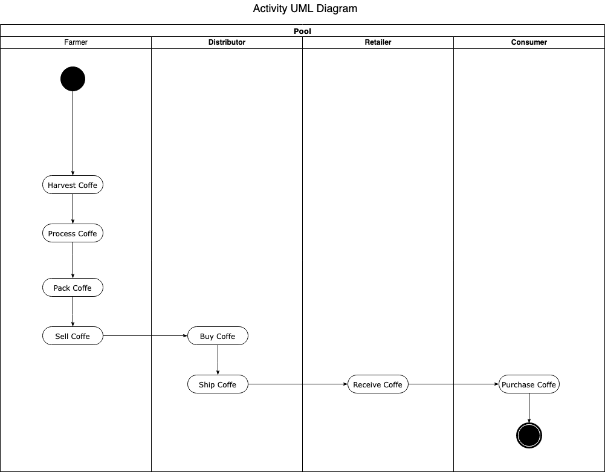
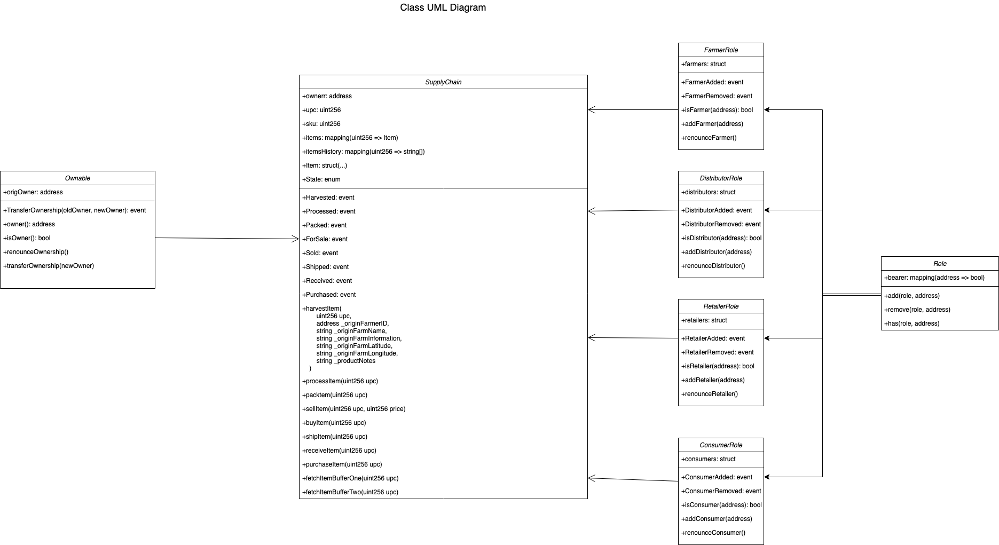
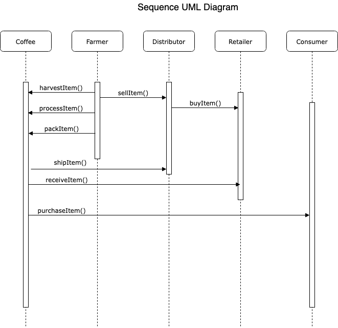
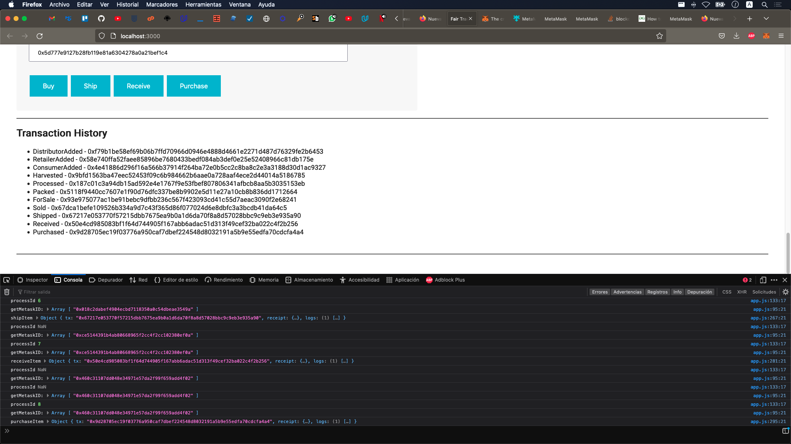

# Project 3 Supply Chain Blockchain Developer 

# UML Diagrams






# Libraries

```
Truffle v5.5.18 (core: 5.5.18)
ganache 2.5.4
node v18.13.0 (lts)
Solidity - 0.4.24 (solc-js)
web3.js 1.8.0
```

IPFS : not used.

Dapp with ganache-cli working as expected:




After several attemps, can't deploy to public network as described in Knownledge:

https://knowledge.udacity.com/questions/922199