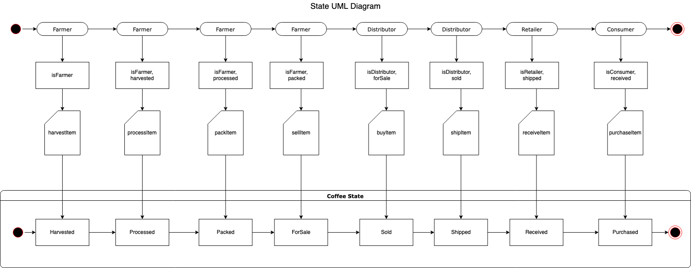

# Project 3 Supply Chain Blockchain Developer

This repo is a clone from the template: https://github.com/udacity/nd1309-Project-6b-Example-Template
with the funcionality needed to start the Dapp and Smart Contract of a Supply Chain between an Seller and Buyer of Coffe.

This repo runs locally with ganache-cli, and potentially connect to an public testnet like Goerli.

# UML Diagrams 




# Libraries used

```
Truffle: Development enviroment and testing framework for Ethereum.
ganache: Locally run ethereum blockchain for testing purposes, part of truffle suite.
node: Javascript runtime needed to run truffle, ganache and run the dapp.
Solidity: Language for implement smart contracts.
web3.js: Collection of js libraries that allows to connect to ethereum networks using http, ipc or websocket.
```

IPFS : not used.

The instructions are separated to run this repo locally and remote.

# Run local

To run this dapp locally we need node lts (v18.13.0), ganache-cli, Truffle and enabled MetaMask extension in the browser; after cloning this repo:


```
nvm use --lts
npm install
npm i -g truffle@4.1.14
npm i -g ganache-cli
```

I use iTerm2, so after install the prerequisites a new window is needed to run ganache-cli:

```
ganache-cli -m "spirit supply whale amount human item harsh scare congress discover talent hamster"
```
After that ganache will run on 8545 port.

Check the truffle.js file must have the development network enabled:

```
//truffle.js

module.exports = {
  networks: {
    development: {
      host: "127.0.0.1",
      port: 8545,
      network_id: "*" // Match any network id
    },
  }
};
```

Open a new console window , make sure the node lts is used, then compile the contracts with 'truffle compile':

```
(base) ➜  nd1309-Project-6b2 git:(main) ✗ truffle compile
Compiling ./contracts/Migrations.sol...
Compiling ./contracts/coffeeaccesscontrol/ConsumerRole.sol...
Compiling ./contracts/coffeeaccesscontrol/DistributorRole.sol...
Compiling ./contracts/coffeeaccesscontrol/FarmerRole.sol...
Compiling ./contracts/coffeeaccesscontrol/RetailerRole.sol...
Compiling ./contracts/coffeeaccesscontrol/Roles.sol...
Compiling ./contracts/coffeebase/SupplyChain.sol...
Compiling ./contracts/coffeecore/Ownable.sol...
Writing artifacts to ./build/contracts
```

Migrate the contracts with 'truffle migrate':

```
(base) ➜  nd1309-Project-6b2 git:(main) ✗ truffle migrate
Using network 'development'.

Running migration: 1_initial_migration.js
  Deploying Migrations...
  ... 0xce5f73fbafea587455079f40b5e669461763c71272af3ee6d3806ba305e1f614
  Migrations: 0xfeecff2cb7d6f3bfcbe5fa41c49c8fb642f2ddbf
Saving successful migration to network...
  ... 0x77dc3c694f829a4415d527b5a5d6f61bac7fde7fb4529a24e37b89265426f18f
Saving artifacts...
Running migration: 2_deploy_contracts.js
  Deploying FarmerRole...
  ... 0x1cd15cbffcbe750d17f676c999da61b3704271533cf6dc313b19e92693e72acc
  FarmerRole: 0xf2ee0b0cdcae5013930b92c0ba54f7f7f1933613
  Deploying DistributorRole...
  ... 0x358e84c480ed51b58bd4531453a36adc0b7d28cded21a8a40325866974e910d3
  DistributorRole: 0xd22de155853b67ce1ca3693fbe52ee958f755e7b
  Deploying RetailerRole...
  ... 0x212ed9f35771fe3c6f2b5a9a4751933717f4e1949ab001088a4a74e70e3c7e0f
  RetailerRole: 0x79051a2fafcc216a55d3897474012145d158f170
  Deploying ConsumerRole...
  ... 0xb4f11be2d7adb5d7505a8b33048ed86af4951e189ad02a497183dc47d79e561e
  ConsumerRole: 0xa65b87754e0a73860aa6b7eb6e95d79cd2d893d2
  Deploying SupplyChain...
  ... 0xf9c491d302730b8f6e32335fd0f251df53d1b274033111b00dc476fac6366d8a
  SupplyChain: 0x23e2b13b08a22e9eee431f862ec7a17ab1e99b98
Saving successful migration to network...
  ... 0x1ed6389096a9cf1ae70a5e27f7df03d5b58f8c75513becddaa8a79608533309a
Saving artifacts...
```

Test the smart contracts:

Check the test/TestSupplychain.js file, line 17 must be 'const productPrice = web3.toWei(1, "ether")' and run the test with 'truffle test':

```
((base) ➜  nd1309-Project-6b2 git:(main) ✗ truffle test
Using network 'development'.

ganache-cli accounts used here...
Contract Owner: accounts[0]  0x27d8d15cbc94527cadf5ec14b69519ae23288b95
Farmer: accounts[1]  0x018c2dabef4904ecbd7118350a0c54dbeae3549a
Distributor: accounts[2]  0xce5144391b4ab80668965f2cc4f2cc102380ef0a
Retailer: accounts[3]  0x460c31107dd048e34971e57da2f99f659add4f02
Consumer: accounts[4]  0xd37b7b8c62be2fdde8daa9816483aebdbd356088


  Contract: SupplyChain
    ✓ Testing smart contract function harvestItem() that allows a farmer to harvest coffee (314ms)
    ✓ Testing smart contract function processItem() that allows a farmer to process coffee (151ms)
    ✓ Testing smart contract function packItem() that allows a farmer to pack coffee (147ms)
    ✓ Testing smart contract function sellItem() that allows a farmer to sell coffee (154ms)
    ✓ Testing smart contract function buyItem() that allows a distributor to buy coffee (191ms)
    ✓ Testing smart contract function shipItem() that allows a distributor to ship coffee (116ms)
    ✓ Testing smart contract function receiveItem() that allows a retailer to mark coffee received (167ms)
    ✓ Testing smart contract function purchaseItem() that allows a consumer to purchase coffee (173ms)
    ✓ Testing smart contract function fetchItemBufferOne() that allows anyone to fetch item details from blockchain
    ✓ Testing smart contract function fetchItemBufferTwo() that allows anyone to fetch item details from blockchain


  10 passing (2s)
```

Then launch the dapp with 'npm run dev':

```
(base) ➜  nd1309-Project-6b2 git:(main) ✗ npm run dev

> supply-chain-E@1.0.0 dev
> lite-server

** browser-sync config **
{
  injectChanges: false,
  files: [ './**/*.{html,htm,css,js}' ],
  watchOptions: { ignored: 'node_modules' },
  server: {
    baseDir: [ './', './src', './project-6/build/contracts' ],
    middleware: [ [Function (anonymous)], [Function (anonymous)] ]
  }
}
[Browsersync] Access URLs:
 ------------------------------------
       Local: http://localhost:3000
    External: http://192.168.1.8:3000
 ------------------------------------
          UI: http://localhost:3001
 UI External: http://localhost:3001
 ------------------------------------
[Browsersync] Serving files from: ./
[Browsersync] Serving files from: ./src
[Browsersync] Serving files from: ./project-6/build/contracts
[Browsersync] Watching files...
23.01.11 13:41:07 200 GET /index.html
23.01.11 13:41:07 200 GET /style.css
23.01.11 13:41:07 200 GET /js/app.js
23.01.11 13:41:07 200 GET /js/web3.min.js
23.01.11 13:41:07 200 GET /js/truffle-contract.js
23.01.11 13:41:07 404 GET /favicon.ico
23.01.11 13:41:16 200 GET /build/contracts/SupplyChain.json
23.01.11 13:42:17 200 GET /
```

This will open a new window in your browser, open metamask, create new network to add the ganache-cli running on 8545 port (i used the instructions here: https://www.geeksforgeeks.org/how-to-set-up-ganche-with-metamask/) and import like 4 accounts with their respective private-keys provided in ganache-cli console.

In the dapp we need to add the roles first, i did that selecting the contract owner account in metamask:

```
Contract Owner: accounts[0]  0x27d8d15cbc94527cadf5ec14b69519ae23288b95
```

Then in the dapp add the roles by clicking 'Add Distributor', 'Add Retailer', and 'Add Consumer'.

After that, in the Farm Details section we click 'Harvest', 'Process', 'Pack' and 'ForSale' with the farmer or accounts[1] account, then with the Distributor account selected in metakask, in the section 'Product Details' of the dapp click in 'Buy' and 'Ship' to approve the transactions, the you have to do the same for Retailer and Consumer for 'Receive' and 'Purchase'.

That's all to make run the dapp locally.


Dapp with ganache-cli working as expected:


To attemp to deploy to goerli i have tried cloning again the repo, with the latest version of truffle:

```
nvm use --lts
npm install
npm install -g truffle
Truffle v5.5.18 (core: 5.5.18)
```

Changed truffle.js to truffle-config.js, with this setup, after create infura key and goerli account with funds:

```
//truffle-config.js

const HDWalletProvider = require("@truffle/hdwallet-provider");
const infuraKey = "1dede18da4a8445b9df425b65543ba21";

//mnemonic deleted
const mnemonic = "";

module.exports = {
  networks: {
    development: {
      host: "127.0.0.1",
      port: 8545,
      network_id: "*" // Match any network id
    },
     goerli: {
       networkCheckTimeout: 10000,
       provider: () => new HDWalletProvider(mnemonic, `https://goerli.infura.io/v3/${infuraKey}`),
       network_id: 5,       // goerli's id
    //   // gas: 4465030,        // goerli has a lower block limit than mainnet
    //   // gasPrice: 10000000000
    //   // gas and gasPrice commented because of this:
    //   // "FarmerRole" -- VM Exception while processing transaction: Transaction's maxFeePerGas (10992342) is less than the block's baseFeePerGas (28116044110) (vm hf=london -> block -> tx) -- Reason given: Custom error (could not decode)..
    // Configure your compilers
    compilers: {
      solc: {
        version: "0.4.24",    // Fetch exact version from solc-bin (default: truffle's version)
        // docker: true,        // Use "0.5.1" you've installed locally with docker (default: false)
        // settings: {          // See the solidity docs for advice about optimization and evmVersion
        //  optimizer: {
        //    enabled: false,
        //    runs: 200
        //  },
        //  evmVersion: "byzantium"
        // }
      }
    }
  }
};
```

Test the smart contracts:

Check the test/TestSupplychain.js file, line 17 must be 'const productPrice = web3.utils.toWei("1", "ether")' and run the test with 'truffle test':


Tried to migrate to public network:

```
truffle migrate --network goerli
```

After several attemps, can't deploy completly to goerli public network as described in Knowledge:

https://knowledge.udacity.com/questions/922199

Goerli contract address(partial): 0xe22c7020a62a434fd0dc865bc878a40221e28321
Account address: 0x608fb40021b0AcC92cC3fA5595a9c2b3a093Efe6


